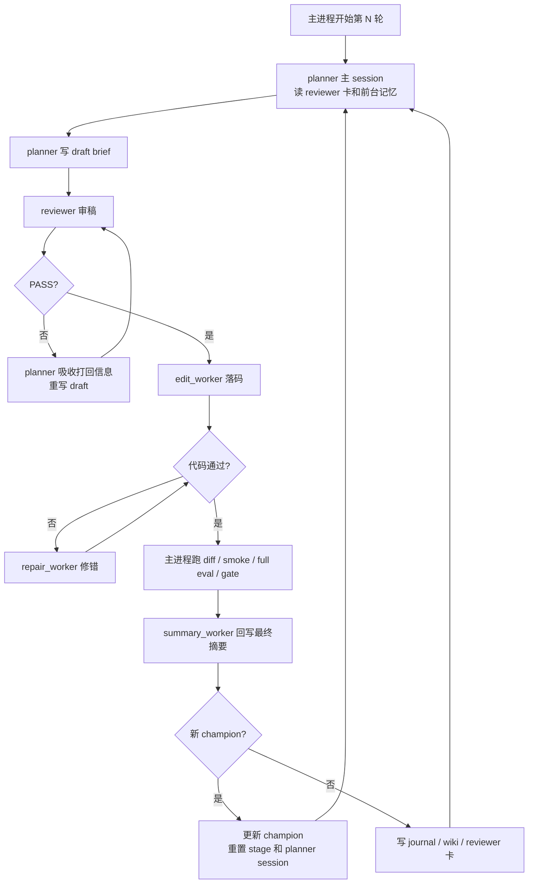

# Quant AI Research

`OKX BTC-USDT-SWAP` 激进趋势策略研究仓库。这里的 `SWAP` 指 OKX 的 `USDT` 本位永续合约。

这个仓库当前只维护一条主线：同一套策略源码、同一套回测器、同一套研究器，以及一套后续可接 `OKX` 自动交易的实盘外壳。

## 当前范围

- 策略源码：[src/strategy_macd_aggressive.py](src/strategy_macd_aggressive.py)
- 回测器：[src/backtest_macd_aggressive.py](src/backtest_macd_aggressive.py)
- 研究器：[scripts/research_macd_aggressive_v2.py](scripts/research_macd_aggressive_v2.py)
- 管理脚本：[scripts/manage_research_macd_aggressive_v2.sh](scripts/manage_research_macd_aggressive_v2.sh)
- stage 重开脚本：[scripts/reset_research_macd_aggressive_v2_stage.sh](scripts/reset_research_macd_aggressive_v2_stage.sh)
- 数据下载脚本：[scripts/download_aggressive_data.py](scripts/download_aggressive_data.py)
- 实盘外壳说明：[real-money-test/README.md](real-money-test/README.md)

## 数据与评分

- 数据源：`OKX`
- 事实层：`15m`
- `1h / 4h` 由 `15m` 聚合得到，只做趋势和环境确认
- 回测执行价优先使用 `1m`
- 当前评分口径：`trend_capture_v6`

时间窗口：

- `train`：`2023-07-01` 到 `2024-12-31`
- `val`：`2025-01-01` 到 `2025-12-31`
- `test`：`2026-01-01` 到 `2026-03-31`

晋升规则：

- 候选必须先过 `gate`
- 再满足相对当前 active reference 的 `promotion_delta > 0.02`
- `test` 只在新 champion 时运行，只做观察记录，不参与晋升，也不进入 prompt
- 复杂度信息现在只做只读诊断，只写入 journal / wiki 供人工查看，不再进入 planner / reviewer prompt，也不再自动触发压缩任务

## 研究器运行方式

1. 运行时只维护一个 active reference。
   在还没有 gate-passed 版本时，它是 `baseline`；一旦出现 gate-passed 版本，它就是 `champion`。
2. `planner` 用持久 session，只负责提出 round brief；但顺序上先看结构化失败反馈，先判断上一轮为什么失败、这轮该继续还是转向，再写 brief。
   它会优先读 `reviewer_summary_card` 和 `direction_board`，避免在当前 champion 下继续横移到已经高热的旧方向。
3. `reviewer` 是每轮全新的短生命周期审稿 worker。它只审 planner 的 draft brief，结论只有 `PASS` 或 `REVISE`；若打回，planner 必须先吸收 reviewer 打回信息，再重写 brief。
4. `edit_worker / repair_worker` 是短生命周期 worker，只负责把 reviewer 放行后的方向落到 [src/strategy_macd_aggressive.py](src/strategy_macd_aggressive.py)。
   整份策略文件都允许修改，但要求改动克制、结构准确、添加有必要；系统只保留必要符号与源码形状护栏。
5. 候选必须先形成真实源码 diff，再过 `smoke`，再跑完整 `train walk-forward + val`。
6. `behavioral_noop`、空 diff、重复源码、重复结果盆地、非法 brief、reviewer 连续打回都会被挡下。
7. complexity 诊断仍会进入 journal 和 wiki，但不会再自动改研究车道，也不会单独沉淀一条 `working_base`。

## Agent / Subagent 工作流

下面这张图按“竖着看”的方式画，`planner` 的持久主 session 在中轴；其余都是围绕它工作的短生命周期 subagent。



当前这套工作流的意思是：

- `planner` 仍然负责研究方向，但它先给出的是 `draft brief`，不是直接进入落码的最终指令。
- `reviewer` 不是第二个 planner。它不能替 `planner` 发明新方向，只能判断这份 draft 当前值不值得试。
- 如果 `reviewer=REVISE`，本轮不会进入 `edit_worker`。`planner` 必须先吸收打回理由，再重写 draft。
- 如果 `reviewer=PASS`，才会进入 `edit_worker` 落码。
- `repair_worker` 只在同轮技术修错时出现，不参与研究方向判断。
- `summary_worker` 只根据最终真实 diff 回写候选摘要，避免“原 brief”和“最终代码”错位。
- `direction_board` 只记录“当前 active reference 下各主方向的后验热度”，不是全局因子黑名单，也不是运行时硬门。
- `latest_history_package` 现在只保留给模型最有用的前台记忆：执行摘要、失败核、方向风险、过热簇和最近轮次元信息，不再把整套表格反复塞进主上下文。
- 策略对外执行仍只保留粗粒度主标签，但回测、评估和 freqtrade `enter_tag` 会同步记录路径标签，便于诊断到底是哪条入场路径在拖分。
- 如果本轮刷新了 `champion`，主进程会更新 active reference，并开启新的 stage / planner session。
- 如果本轮没有刷新 `champion`，主进程会把结果写回 `journal / wiki / reviewer_summary_card / direction_board`，然后直接开始下一轮。

更完整的说明见 [docs/agent_subagent_workflow.md](docs/agent_subagent_workflow.md)。

## 手工瘦身 SOP

当前复杂度不再由系统自动压缩。推荐人工 SOP：

1. 停掉研究器。
2. 手工瘦身当前策略，或手工替换 active reference。
3. 执行 [scripts/reset_research_macd_aggressive_v2_stage.sh](scripts/reset_research_macd_aggressive_v2_stage.sh)。
   这个脚本会保留 `memory/raw/*`，但清空 front memory、session、workspace 和当前 stage journal。
4. 重新启动研究器，进入新 stage。

## 常用命令

下载或重建本地 OKX 数据：

```bash
python3 scripts/download_aggressive_data.py
```

启动研究器：

```bash
bash scripts/manage_research_macd_aggressive_v2.sh start
```

查看状态：

```bash
bash scripts/manage_research_macd_aggressive_v2.sh status
```

停止研究器：

```bash
bash scripts/manage_research_macd_aggressive_v2.sh stop
```

重开一个新 stage：

```bash
bash scripts/reset_research_macd_aggressive_v2_stage.sh
```

单轮运行一次研究器：

```bash
python3 scripts/research_macd_aggressive_v2.py --once
```

## 文档导航

- [STRATEGY.md](STRATEGY.md)
  用非工程语言解释当前策略在看什么、怎么开仓、怎么退出。
- [docs/macd_aggressive_current_state.md](docs/macd_aggressive_current_state.md)
  解释当前评分、gate、session、memory、Discord 播报和运行目录。
- [docs/agent_subagent_workflow.md](docs/agent_subagent_workflow.md)
  专门解释 `planner / reviewer / edit_worker / repair_worker / summary_worker / 主进程` 之间怎么配合。
- [real-money-test/README.md](real-money-test/README.md)
  解释 `freqtrade` dry-run / live 外壳如何接这套策略。

## 目录速览

```text
config/              研究器配置、凭证样板、人工方向卡
data/                OKX 价格、funding、指数数据
docs/                当前状态文档
logs/                研究器日志与模型调用日志
real-money-test/     freqtrade dry-run / live 外壳
scripts/             下载、研究、管理、stage reset 脚本
src/                 策略、回测器、研究器依赖模块
state/               active reference 状态、journal、memory、heartbeat、session
tests/               研究器相关测试
```
