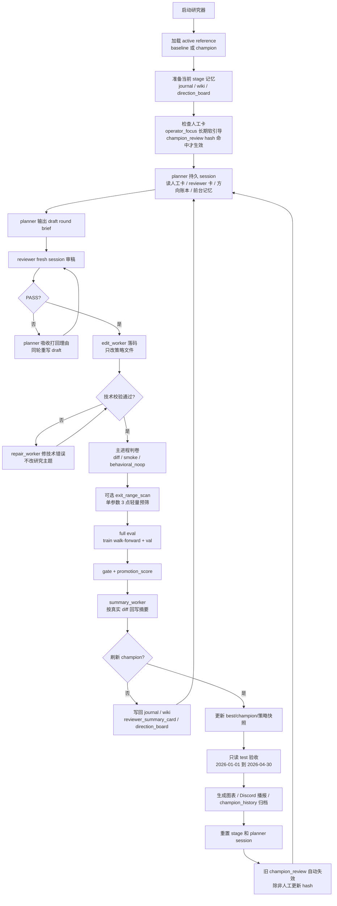

# 研究器 SOP

这份文档是当前 GitHub 内的主 SOP，描述研究器从启动、出方案、落码、评估、刷新 champion 到人工介入的完整流程。

## 一图看懂



## 核心原则

- 研究器只维护一个 active reference：没有合格版本时是 `baseline`，有合格版本后是 `champion`。
- `planner` 负责想方向，不直接写代码；`reviewer` 负责拦坏方向，不替 planner 发明方向。
- `edit_worker` 只把 reviewer 放行后的方向落到 `src/strategy_macd_aggressive.py`。
- 主进程负责判卷，不负责想策略。
- `test` 对新 champion 同步运行；对已完成完整评估但未保留的候选会后台异步补跑，只做人工只读留档，不参与晋升，不进入普通调参循环，也不注入 planner / reviewer prompt。
- 人工卡都是软引导，不是硬 gate；当前 champion 人工观察卡必须 hash 命中才会给 planner 看。

## 当前数据与评分口径

- 标的：`BTC-USDT-SWAP`，策略按 `20x` 合约研究。
- 事实层：`15m`；`1h / 4h` 由 `15m` 聚合，只做确认层。
- 执行层：优先使用 `1m` 回测成交。
- 评分口径：`robust_block_v26_activity_mean`。
- `train`：`2023-07-01` 到 `2024-12-31`。
- `val`：`2025-01-01` 到 `2025-12-31`。
- `test`：`2026-01-01` 到 `2026-04-30`。
- 晋升条件：候选先过 `gate`；已有 champion 时，还必须 `promotion_score` 严格高于当前 active reference。当前取消的是额外晋级边际，不是取消“评分更高才替换”的核心规则。
- 唯一例外是系统排队的“结构自检修复轮”：它不是普通追分轮，只在通过现有基础安全门后跳过 `promotion_score` 比较，用来替换掉明显局部过拟合或结构膨胀的 active reference。
- v26 主分是活跃度调整后的稳健时间块收益：train/val 各自用 `28` 天收益块的 `mean/median/P25` 聚合，`min` 只做诊断；低月频只折扣正收益。
- `benchmark_hurdle_score = max(0, buy_hold_robust_score) * 0.25`，只在 buy&hold 自身稳健分为正时形成轻量基准扣分。
- `main_score = robust_time_score - benchmark_hurdle_score`。
- `promotion_score = main_score - drawdown_penalty_score - robustness_penalty_score - trade_idle_penalty`。
- 主评分使用连续 `train / val` 数据源；`train` 从已有 `train+val` 连续回测按 `val` 起点切出，walk-forward 继续用于诊断和早停。
- walk-forward 诊断按 v26 robust block 分；提前淘汰直接复用已完成的 walk-forward 窗口结果，不再额外重跑累计 train 区间。
- `capture_score` / `capture_core` 只作为趋势诊断，不进入主评分，也不再给收益做倍率。capture 仍使用固定 clean trend segments，并保留“段等权均分 50% + 原权重均分 50%”的混合口径。
- 参数步长现在是高优先级软约束，不是技术 gate：默认避免只做近邻阈值微调；如果需要小步长修正，planner 必须说明它会改变哪条真实交易路径、漏斗节点或持仓管理行为。真正的硬拦截是 smoke 行为不变、源码安全校验、gate 和 promotion。
- 当前策略源码已做等价压缩；复杂度默认只做诊断，不拦普通候选。结构自检修复不再按复杂度阈值或连续失败即时触发，而是按周期整理。
- Fear & Greed 情绪数据只作为策略可选输入暴露在 `market_state`，不进入评分、gate 或强制优化目标。
- Sharpe 不进入主评分，只保留为人工筛选和通知展示指标。
- 交易频率按非加仓开仓数计算，加仓不计入；目标约 `train 180-270 / val 120-180`，也就是 `10-15` 笔/月。低频通过 activity multiplier 折扣正收益，最长无新开仓超过约 `7` 天才扣空窗分；趋势机会覆盖只做诊断。
- 回测执行层允许总仓位上限内多空并行；`max_concurrent_positions` 统计独立 position，加仓只改变已有 position 的规模，不占用这个数量；混合持仓时，信号层按方向扫描持仓，不再只看第一个 position。
- 交易数、`filled_entries` 和漏斗通过量只保留观察价值，不再作为下一轮方向的默认软触发。
- Regime scorecard 只做解释工具，不进入评分或 gate；它复用已有 ADX/CHOP/ATR、flow、成交量代理、Fear & Greed 和价格自身波动，帮助判断什么时候适合动量、什么时候应该缩手。
- 鲁棒性软惩罚不额外回测；它复用已有 train/val 稳健收益块和 `train/val` Ulcer，检查两侧分布是否严重不一致。
- `test` 只做人工只读观察；reject / duplicate_skipped 的异步 `test` 只进留档，不进 prompt、不进晋升；demo 是否可用也只由人工判断，不写进模型方向卡。

## 每一轮怎么跑

1. 主进程读取当前 active reference、窗口配置和 stage 记忆。
2. 若 `config/research_v2_champion_review.md` 的 `champion_code_hash` 命中当前 champion，注入这张人工观察卡；否则忽略。
3. `planner` 读取人工卡、上一轮 reviewer 卡、方向账本和前台记忆，写一个单一假设的 draft brief。
4. `reviewer` 审稿，只输出 `PASS` 或 `REVISE`。
5. 若 `REVISE`，planner 必须吸收打回理由，同轮重写；连续打回则本轮停止。
6. 若 `PASS`，`edit_worker` 把方向落到策略源码。
7. 若出现 no-edit、语法错误、缺 helper、校验失败等技术问题，`repair_worker` 只修技术错误。
8. 主进程检查真实 diff、重复源码、smoke 行为和关键漏斗变化。
9. 如果 brief 指定单个连续型 `EXIT_PARAMS` 的 `exit_range_scan`，主进程最多扫 3 个值，只做轻量预筛。
10. 主进程跑完整 `train walk-forward + val`；评分阶段只使用已有评估结果和轻量预筛结果。若候选在前段 walk-forward robust 分与收益分都很差，会直接提前淘汰。
11. 主进程执行 gate 与 promotion 判断。
12. `summary_worker` 按最终真实 diff 回写候选摘要。
13. 没有刷新 champion：写回 `journal / wiki / reviewer_summary_card / direction_board`；若该轮已完成 full eval，则后台异步补跑 `test` 关键指标留档，然后进入下一轮。
14. 刷新 champion：更新策略快照，同步跑 `test`；图表优先复用本轮已评估的 `validation` 与 `train+val` 曲线，避免重复回测；随后 Discord 播报，归档 `champion_history`，然后重置 stage 与 planner session。

## 结构自检修复轮

这是一个轻量安全阀，不是长期模式，也不是新的评分目标。

触发条件：

- 自上次 champion 刷新或结构自检尝试后，普通轮累计完成 `15` 次 full eval / duplicate-result eval。
- champion 刷新会重置计数；结构自检轮无论成功或失败，也会重置计数。
- 复杂度增长和同一 slot / cluster 连续失败只保留为诊断信号，不再直接排队自检。

执行方式：

- 下一轮进入一次性结构自检修复；使用独立 planner session，避免普通研究上下文把注意力继续带回旧方向。
- planner 只判断是否某个 slot、规则链或局部阶段过度学习；只能提出删窄条件、合并重复条件、参数化泛化或移除无效分支。
- edit_worker 仍只能改 `PARAMS`、开放 `EXIT_PARAMS`、`FACTOR_SLOT_PARAMS` 和固定 `_slot_*()` 函数体；自检轮改动后的 `lines / bool_ops / ifs` 净复杂度不得增加。
- 候选仍必须通过源码校验、smoke 行为变化、完整评估和现有 gate。
- 通过基础安全门后，自检轮跳过 `promotion_score` 比较，直接替换 active reference，并把 journal 的 `reference_update_kind` 记为 `structural_audit_replace`。
- 自检轮失败后回到当前 active reference，不连环触发自检。

## 各角色职责

### planner

- 普通研究轮是唯一持久 session；结构自检修复轮使用独立短 session。
- 负责提出研究方向和单一可证伪假设。
- 必须先读当前人工卡、reviewer 卡、direction board 和前台记忆。
- 如果 reviewer 打回，必须先吸收打回理由再重写。
- 同一 stage 内即使出现 `behavioral_noop`、同轮重生或方向切换，也继续复用这个 session；只有重开 stage 或刷新 champion 才重置。

### reviewer

- 每轮 fresh session。
- 只审 planner 的 draft 是否值得落码。
- 重点检查是否旧失败近邻、是否只换标签、是否说明真实交易路径变化。
- 不写代码，不替 planner 提新方案。

### edit_worker

- 只接收 reviewer 放行后的 brief。
- 只改 `src/strategy_macd_aggressive.py`。
- 当前策略是固定框架 + 固定因子槽结构；只能调整 `PARAMS` 既有 key、开放的 `EXIT_PARAMS`、`FACTOR_SLOT_PARAMS` 和固定 `_slot_*()` 函数体。
- 不允许改 `_strategy_core()`、候选生成顺序、slot 名称/数量/签名、`strategy()` / `strategy_decision()` 入口，也不允许新增 top-level helper 或参数 key。
- 杠杆、单仓上下限和加仓规模保持固定；`position_fraction` 与 `max_concurrent_positions` 现在允许研究器探索。

### repair_worker

- 只处理同轮技术错误。
- 不改研究主题，不重新想方向。

### summary_worker

- 只根据最终源码 diff 和最终候选代码写摘要。
- 用来避免“planner 原本想改什么”和“代码实际改了什么”错位。

### 主进程

- 负责调度、校验、评估、gate、归档、播报和记忆回写。
- 不替 planner 想策略。

## 人工介入 SOP

### 临时给 planner 一句直觉

编辑：`config/research_v2_champion_review.md`

如果你在 Codex 里操作，也可以走本地 skill：

- [research-champion-review-card](../.codex/skills/research-champion-review-card/SKILL.md)
- 这个 skill 只封装流程：读取当前 champion hash、确认当前轮是否已经启动、回写 hash 绑定的人工卡。
- 卡里的摘要内容、软约束，以及要不要回看多少轮历史，留给人工讨论，不在 skill 里预设。

要求：

- 内容应短尽短。
- 必须保留 `champion_code_hash`。
- 只写针对当前 champion 的观察。
- 新 champion 后 hash 不匹配，旧卡会自动失效。

当前示例：

```text
champion_code_hash: <当前 champion hash>

直觉看了一下图片，觉得现在的问题在退出方向，应该想办法保住收益。
```

### 长期方向偏好

编辑：`config/research_v2_operator_focus.md`

用途：长期软引导，例如优先方向、降权方向、默认动作。它不绑定 champion hash，不会自动失效。

### 手工瘦身或替换 active reference

1. 停掉研究器：`bash scripts/manage_research_macd_aggressive_v2.sh stop`
2. 手工修改策略或替换 active reference。
3. 如果替换的是旧 source，先迁移到当前固定因子槽结构，并确认 `validate_strategy_source()` 能通过。
4. 用当前源码重建 reference：`python3 scripts/research_macd_aggressive_v2.py --reset-champion --no-optimize`
5. 重开 stage：`bash scripts/reset_research_macd_aggressive_v2_stage.sh`
6. 启动研究器：`bash scripts/manage_research_macd_aggressive_v2.sh start`
7. 跟状态：`bash scripts/manage_research_macd_aggressive_v2.sh status`

补充约束：

- 研究器是由 `scripts/run_research_macd_aggressive_v2.sh` 这个 supervisor 循环拉起；不要只停内部 python 进程，否则 supervisor 会自动重启。
- 如果这次改的是当前 active reference 本体，除了 `src/strategy_macd_aggressive.py`，还要同步本机上的 `backups/strategy_macd_aggressive_v2_best.py` 与 `backups/strategy_macd_aggressive_v2_champion.py`，因为启动时主进程会先从 `best` 快照装载基底；这两个快照现在只作本地运行态文件，不再提交到 GitHub。

## 常用命令

```bash
# 启动
bash scripts/manage_research_macd_aggressive_v2.sh start

# 查看状态
bash scripts/manage_research_macd_aggressive_v2.sh status

# 停止
bash scripts/manage_research_macd_aggressive_v2.sh stop

# 重开 stage
bash scripts/reset_research_macd_aggressive_v2_stage.sh

# 单轮运行
python3 scripts/research_macd_aggressive_v2.py --once

# 重建 OKX 数据
python3 scripts/download_aggressive_data.py
```

## 运行产物

- `state/research_macd_aggressive_v2_best.json`：当前 best/champion 状态。
- `backups/strategy_macd_aggressive_v2_best.py`：当前 best 策略快照，仅保留在本机运行环境。
- `backups/strategy_macd_aggressive_v2_champion.py`：当前 champion 策略快照，仅保留在本机运行环境。
- `backups/strategy_macd_aggressive_v2_candidate.py`：运行中的候选快照，不应随手提交。
- `backups/champion_history/`：每次新 champion 的独立归档。
- `backups/research_v2_round_artifacts/`：每轮最小可复现归档；源码按 `code_hash` 去重，accepted 轮次会额外引用 champion 图表/快照；rejected full eval 轮次会异步补写 `test` 关键指标。
- `reports/research_v2_charts/`：selection / validation 图表。
- `logs/macd_aggressive_research_v2.log`：主日志。
- `logs/macd_aggressive_research_v2_model_calls.jsonl`：模型调用日志。
- `state/research_macd_aggressive_v2_memory/wiki/`：前台记忆、方向账本、失败 wiki、reviewer 卡。
- `src/research_v2/reference_state.py`：reference 状态读写
- `src/research_v2/champion_artifacts.py`：champion 快照归档
- `src/research_v2/round_artifacts.py`：每轮最小可复现归档
- `src/research_v2/backtest_window_runtime.py`：回测窗口运行态
- `src/research_v2/evaluation_summary.py`：评分汇总组装
- `src/research_v2/journal_prompt_builder.py`：journal prompt 组装

## 提交代码时的注意事项

- 研究器运行中会持续改写候选和策略文件。
- `backups/strategy_macd_aggressive_v2_best.py` 与 `backups/strategy_macd_aggressive_v2_champion.py` 现在不再入库；需要分享时单独发送文件，不要重新加入 Git 跟踪。
- 只想提交当前 champion 时，先停研究器，再排除 `backups/strategy_macd_aggressive_v2_candidate.py`。
- 文档、配置或流程改动完成后，要同步更新文档并推送 git。
- 不要把运行中的候选误当成稳定 champion 提交。
